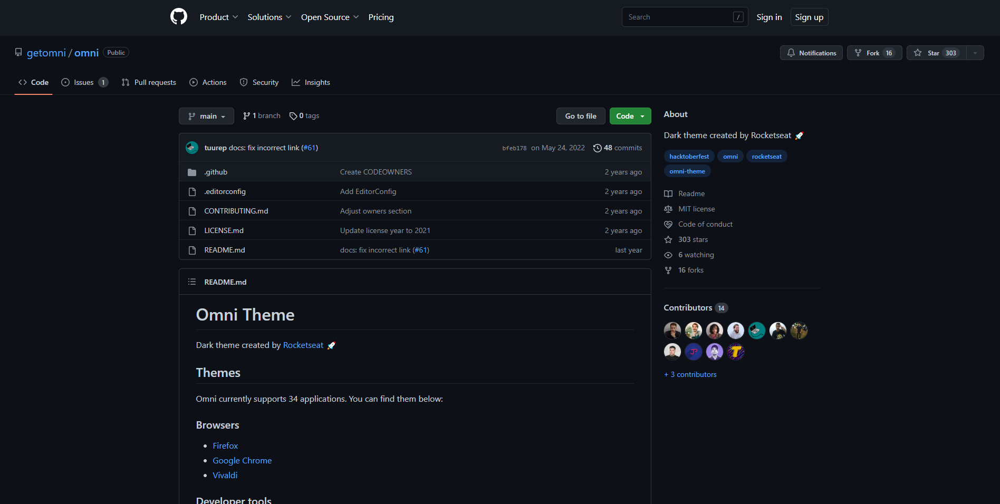
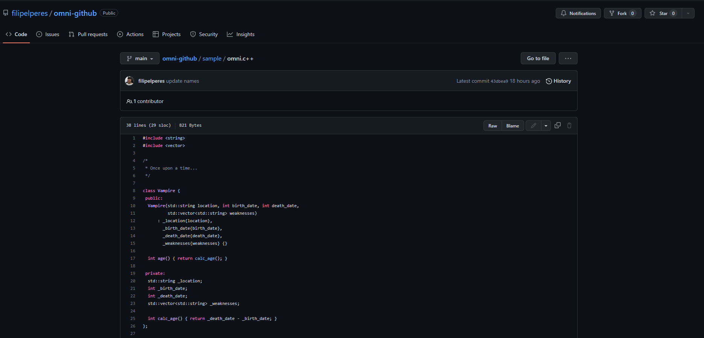

# Omni for [Github](https://github.com/)

## Install

#### Install using Git

If you are a git user, you can install the theme and keep up to date by cloning the repo:

    $ git clone https://github.com/filipelperes/omni-githubextension.git

#### Install manually

Download using the [GitHub .zip download](https://github.com/filipelperes/omni-githubextension/archive/main.zip) option and unzip them.

#### Activating theme

**Chrome**

1. Go to chrome: // extensions /.
2. In the top right corner, activate Developer Mode.
3. Click Load without compression.
4. Find and select the app or extension folder.
5. Open a new tab in Chrome, click Apps, click the app or extension. Make sure it has been loaded and works properly.
6. If necessary, make changes to the manifest.json file, host the app folder and test it again. Repeat until the app or extension works correctly.

**Firefox**

https://addons.mozilla.org/en-US/firefox/addon/github-omni-theme/

## [contributors](https://github.com/filipelperes/omni-youtube/graphs/contributors)

|  |
| -------------------------------------------------------------------------------------------------------- |
| [filipelperes](https://github.com/filipelperes)                                                             |
